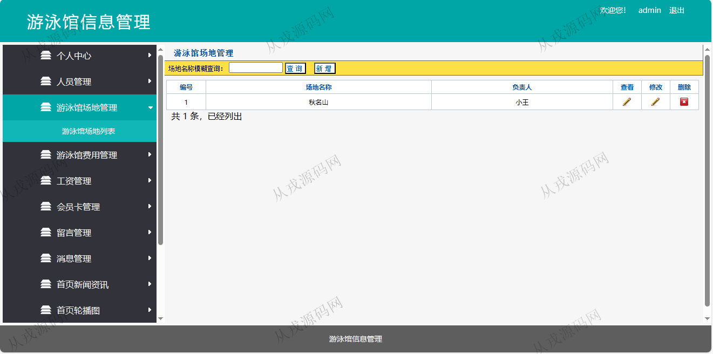
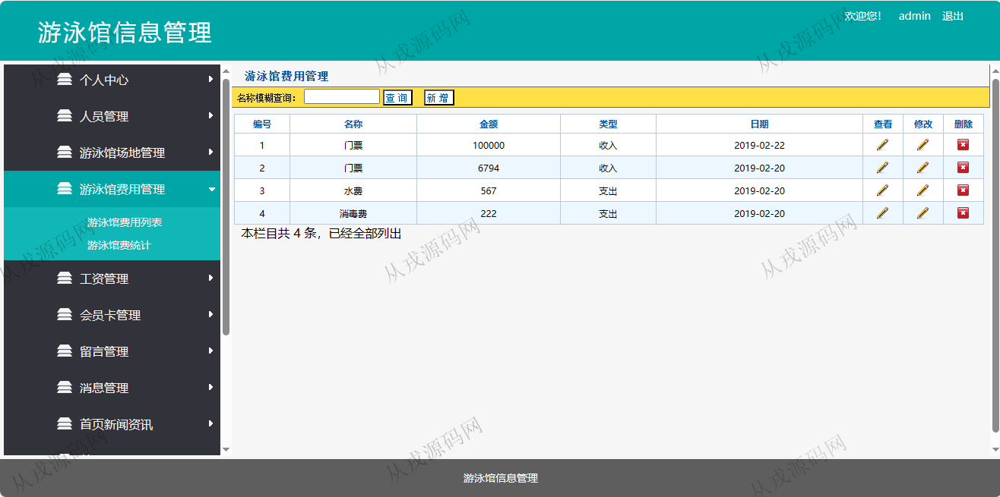
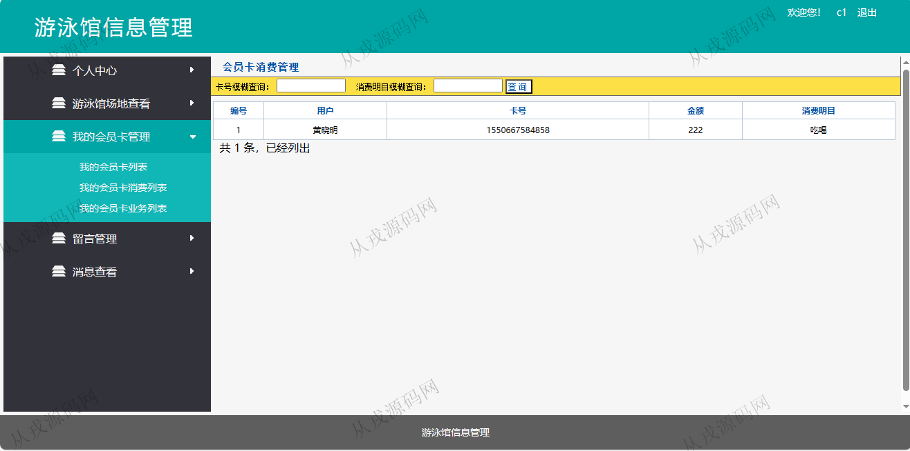
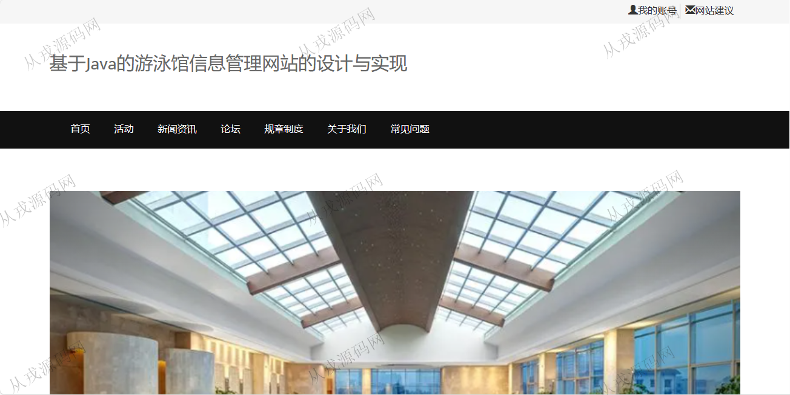
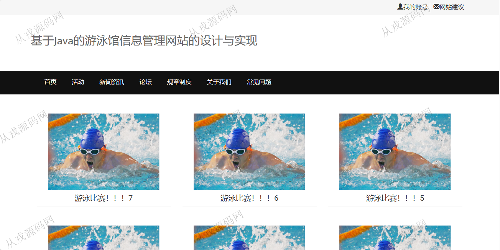
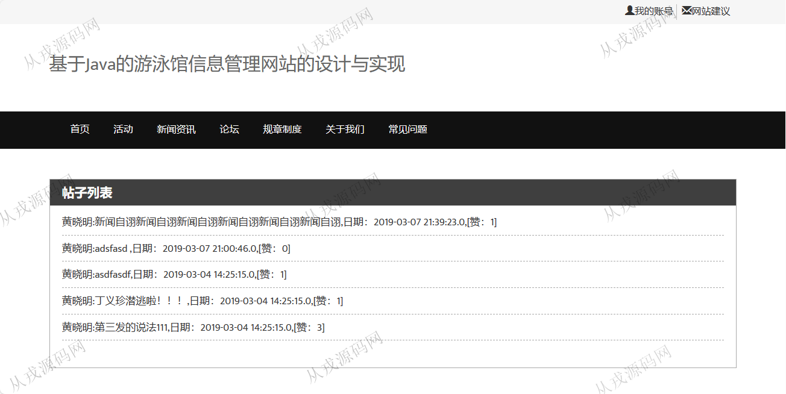
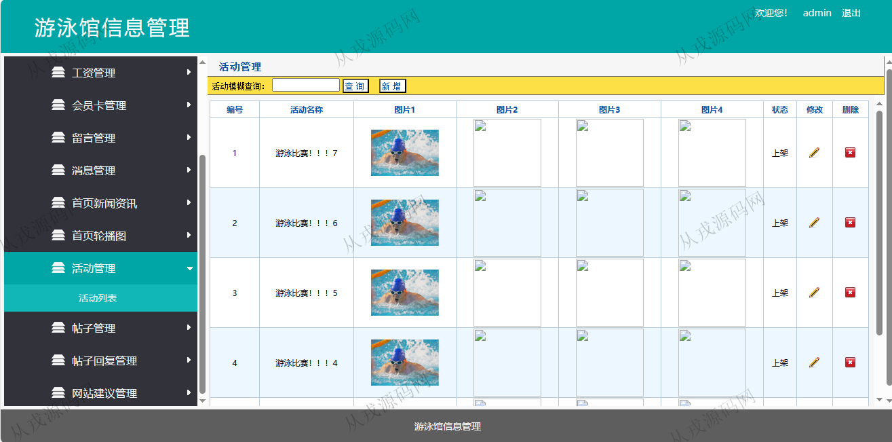

<h1 align="center">158.游泳馆信息管理系统</h1>

- <b>完整代码获取地址：从戎源码网 ([https://armycodes.com/](https://armycodes.com/))</b>
- <b>技术探讨、资料分享，请加QQ群：692619798</b> 
- <b>作者微信：19941326836  QQ：952045282</b> 
- <b>承接计算机毕业设计、Java毕业设计、Python毕业设计、深度学习、机器学习</b>
- <b>选题+开题报告+任务书+程序定制+安装调试+论文+答辩ppt 一条龙服务</b>
- <b>所有选题地址 ([https://github.com/YuLin-Coder/AllProjectCatalog](https://github.com/YuLin-Coder/AllProjectCatalog)) </b>

## 项目介绍
基于java+jsp的游泳馆信息管理系统：前端 jsp、jquery，后端 springmvc、spring、jdbc；角色分为管理员、用户；集成游泳馆场地管理、活动管理、会员卡管理等功能于一体的系统。

## 功能介绍

### 用户

- 基本功能：登录，注册，退出
- 网站首页：主导航栏，轮播图，最新新闻资讯
- 活动：活动列表展示，活动详情，活动评论发布
- 论坛：帖子列表查询，帖子详情，点赞，评论

### 管理员

- 人员管理：用户信息的增删改查，用户也可以在前台自行注册，员工信息的增删改查
- 游泳馆场地管理：游泳馆场地信息的增删改查
- 游泳馆费用管理：费用信息的增删改查，游泳馆费统计
- 工资管理：工资信息的增删改查
- 会员卡管理：会员卡信息的增删改查，会员卡消费列表，会员卡业务列表，会员卡消费统计表
- 留言管理：留言信息列表，留言回复
- 活动管理：活动信息的增删改查，图片上传

## 环境

- <b>IntelliJ IDEA 2021.3</b>

- <b>Mysql 5.7.26</b>

- <b>Tomcat 7.0.73</b>

- <b>JDK 1.8</b>

## 运行截图

